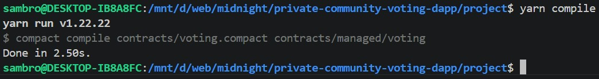
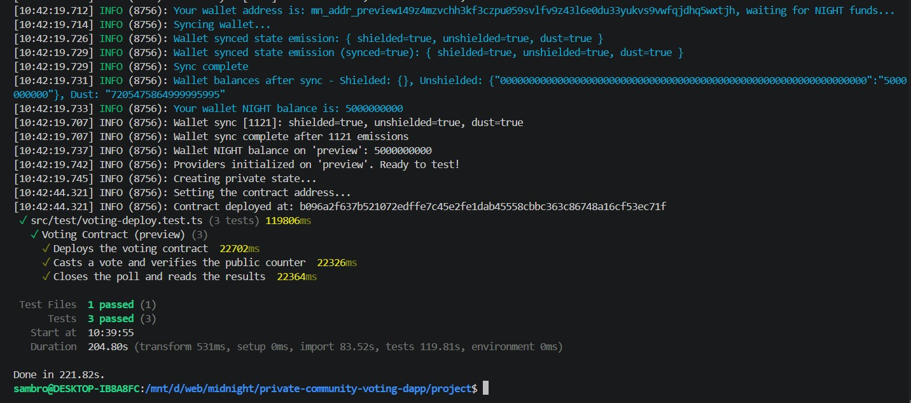

# Midnight Private Community Voting DApp

A privacy-preserving voting application built on the **Midnight Network** using the **Compact** smart contract language.

This project demonstrates how Zero-Knowledge technology can be used to build a secure community voting system where every member can vote privately while keeping the final result publicly verifiable.

---

# Product Idea

Private Community Voting DApp is a decentralized governance application designed for DAOs, communities, associations and organizations that require confidential voting.

Each participant can cast a vote without revealing their identity or vote choice. The blockchain only stores the aggregated voting results, ensuring transparency while preserving voter privacy through Midnight's Zero-Knowledge technology.

---

# Features

- Private voting using Zero-Knowledge Proofs
- Public verification of the final result
- Secure contract deployment on Midnight Preview Network
- Automatic proof generation
- Compact smart contract
- TypeScript deployment and testing

---

# Public State vs Private Witness

## Public State

The following information is stored on-chain and is visible to everyone:

- Poll status (OPEN / CLOSED)
- Total number of votes
- Number of YES votes
- Number of NO votes

This information allows anyone to verify the final voting result.

## Private Witness

Private information never appears on-chain.

The voter's identity is provided through a witness function and is only used during Zero-Knowledge proof generation.

The blockchain verifies the proof without revealing:

- who voted
- how they voted

This guarantees complete voter privacy.

---

# Project Structure

```
project/
│
├── contracts/
│   ├── voting.compact
│   ├── managed/
│   ├── index.ts
│   └── witnesses.ts
│
├── src/
│   ├── config.ts
│   ├── wallet.ts
│   ├── providers.ts
│   └── test/
│
├── screenshots/
│   ├── compile.png
│   └── deployment.png
│
├── package.json
├── compose.yml
├── README.md
└── tsconfig.json
```

---

# Prerequisites

Install the following tools before running the project:

- Node.js (v22 or newer)
- Yarn 1.22.x
- Docker Desktop
- Compact Compiler
- Git

Install Compact globally:

```bash
npm install -g @midnight-ntwrk/compact
```

---

# Installation

Clone the repository:

```bash
git clone https://github.com/sammywasukundi/private-community-voting-dapp.git
```

Move into the project directory:

```bash
cd private-community-voting-dapp/project
```

Install dependencies:

```bash
yarn install
```

---

# Configure Preview Wallet

Copy the example environment file:

```bash
cp .env.preview.example .env.preview
```

Open `.env.preview` and replace the example mnemonic with your own Preview wallet mnemonic.

Example:

```text
MIDNIGHT_PREVIEW_MNEMONIC=your twenty four word mnemonic here
```

---

# Compile the Smart Contract

Compile the Compact contract:

```bash
yarn compile
```

This command generates:

- ZK Circuits
- Proving Keys
- Verification Keys
- TypeScript bindings

inside:

```
contracts/managed/
```

---

# Start the Proof Server

```bash
yarn proof:up
```

---

# Deploy and Test on Preview

Deploy the contract and execute the test suite:

```bash
yarn test:preview
```

A successful execution displays:

- Wallet synchronized
- Contract deployed
- Contract address
- Vote executed
- Poll closed
- All tests passed

---

# Successful Compilation

Insert your compilation screenshot here.

Example:

```
screenshots/yarncompile.jpg
```

```markdown

```

---

# Successful Deployment

Insert your deployment screenshot here.

Example:

```
screenshots/deploy.jpg
```

```markdown

```

---

# Test Results

The deployment test performs the following operations:

- Deploys the voting contract
- Casts a private vote
- Verifies the public counters
- Closes the poll
- Reads the final result

All tests completed successfully on the Midnight Preview Network.

---

# Running Locally

Compile:

```bash
yarn compile
```

Start Proof Server:

```bash
yarn proof:up
```

Run Preview deployment:

```bash
yarn test:preview
```

Stop Proof Server:

```bash
yarn proof:down
```

---

# Technologies Used

- Midnight Network
- Compact
- TypeScript
- Vitest
- Docker
- Node.js
- Zero-Knowledge Proofs

---
